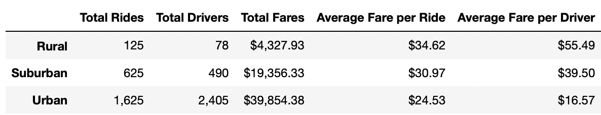

# PyBer_Analysis

## Overview 

### The purpose of this analysis is to understand the disparities in Pyber Ride Share data across three city types (Urban, Suburban, and Rural) in the Jan through April of 2019. 

## Results 

### Looking at Rides Over Time 

The above graph plots out the sum of fares for a week for each city type over the course of four months. As one might expect,  we see that Urban cities have a higher sum of fares for the entirety of the time, while Suburban and Rural cities have respectively less and less. The question is, are these areas cheaper, or are users simply riding less? 

Let's double click into the data. 

There are several data points that stand out here: 

- The total number of drivers in Rural and Suburban cities are significantly less than that in Urban cities, with Rural cities not even reaching a tenth of the Urban total 2,405 drivers. 
- The total number of rides is much lower in Rural and Suburban areas than in Urban, but they have more rides completed than number of drivers in both of these areas. The Urban cities however have 1,943 more drivers available than rides completed.
- The average fare in Rural and Suburban areas are much higher, with the Rural average fare being $10 more than in Urban areas. 

This skew towards less drivers and higher fares means that Rural drivers are seeing much higher payouts (about $55) on their time spent driving compared to Urban drivers who see an average of $16. There seems to be heavy correlation with this difference in demand and these pay differences, though I would recommend looking at average trip length before saying that this was the only causation factor. 

## Summary 

### Conclusions and Recommendations 

I would recommend the following to the executive team at Pyber: 

1) Look at where rides are going. Is it possible that Rural drivers are seeing longer fares because they take passengers to and from Urban destinations? 
2) Look at the average wait times of Rural and Suburban passengers. Are they struggling to find drivers? If so, are they abandoning Pyber for a competitor with more drivers nearby? 
3) After diving into the two recommendations above, I would recommend running internal promotions to encourage Urban drivers to pick up Rural fares. This increases supply to areas that currently have a higher demand and may encourage growth in user adoption once it is easier to find and complete rides. 
    - In conjunction with measuring the impact on number of rides and sum of fares, think about getting a benchmark customer satisfaction score before and after          this program is launched to see if it improves the customer experience. 

